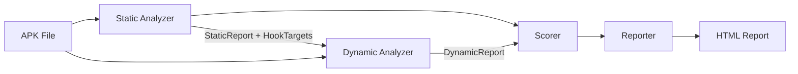
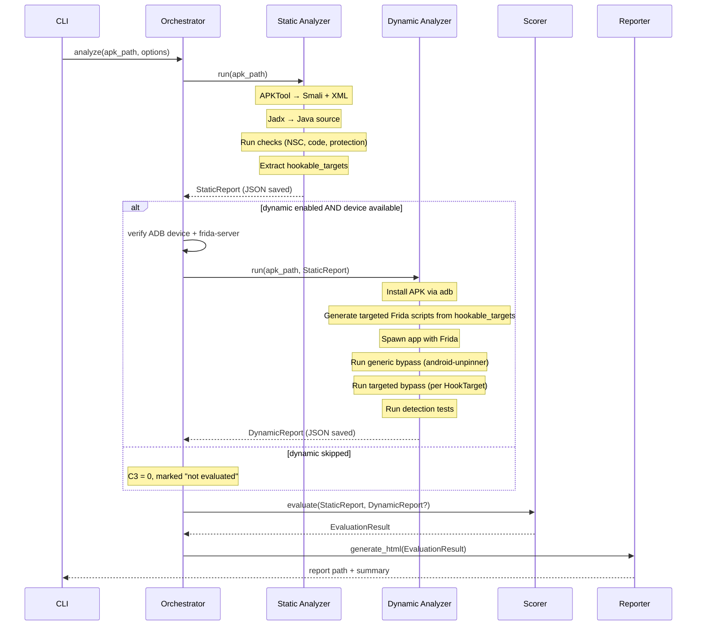

# TLS-PinEval V1 — Revised Architecture

## 1. System Overview

**TLS-PinEval** — algorithm for quantitative assessment of Android app security against TLS pinning bypass. Evaluates across 4 criteria (0–100 each), produces a weighted final score with explainable breakdown.

**This is NOT** a general mobile security platform. It is a focused, thesis-scope tool that demonstrates a novel evaluation algorithm combining static and dynamic analysis with quantitative scoring.

### System Boundaries

| In Scope | Out of Scope |
|----------|-------------|
| TLS pinning implementation analysis | General vulnerability scanning |
| Frida-based bypass testing | Full sandboxing / emulator management |
| Quantitative 4-criteria scoring | Advanced anti-analysis bypass R&D |
| Explainable per-finding reports | UI automation for app interaction |
| CLI-first interface | Web UI (future work) |
| Native Android (Java/Kotlin) apps | Flutter / React Native / Xamarin |
| Device already connected via ADB | Emulator provisioning & lifecycle |

### V1 vs Future Scope

| Feature | V1 (Thesis) | Future |
|---------|:-----------:|:------:|
| Static analysis (all ToR §5 checks) | ✅ | |
| Hookable target extraction | ✅ | |
| Frida bypass execution | ✅ | |
| Anti-Frida/root detection testing | ✅ | |
| Quantitative scoring (C1–C4) | ✅ | |
| HTML report with explanations | ✅ | |
| Confidence & inconclusive handling | ✅ | |
| PDF report | | ✅ |
| MITM traffic interception | minimal | full |
| Emulator lifecycle management | | ✅ |
| Web UI (Flask/Streamlit) | | ✅ |
| Cross-framework (Flutter/RN) | | ✅ |
| Multi-process hooking | | ✅ |
| MobSF parallel comparison | | ✅ |

---

## 2. Architecture

Sequential pipeline (per ToR §4). **Key simplification:** no infra layer — tool calls are inlined in modules that use them.

```
┌───────────────────────────────────────┐
│              CLI (Click)              │
├───────────────────────────────────────┤
│            Orchestrator               │
├────────────┬───────────┬──────────────┤
│  Static    │  Dynamic  │   Scoring    │
│  Analyzer  │  Analyzer │  & Reporter  │
├────────────┴───────────┴──────────────┤
│          Domain Models (Pydantic)     │
└───────────────────────────────────────┘
```



**Removed from V1:** separate `infra/` layer (6 wrappers), `emulator.py`, `adb.py`, `mitmproxy_client.py`, `session_recorder.py`. Tool invocations happen directly inside the module that needs them via simple helper functions in a single `tools.py` utility.

---

## 3. Modules

### 3.1 Utility: `tools.py`

Single file with thin subprocess wrappers: `run_apktool()`, `run_jadx()`, `check_adb_device()`. No lifecycle management — just "call tool, return path to output."

### 3.2 Module 1 — Static Analyzer

**Input:** APK path → **Output:** `StaticReport` (JSON)

| File | Responsibility |
|------|---------------|
| `analyzer.py` | Orchestrates decompilation + runs all checks, merges results, **extracts hookable_targets** |
| `nsc_analyzer.py` | Parse `network_security_config.xml`: pin-set, SHA-256, backup-pin, expiry |
| `code_analyzer.py` | Scan decompiled source for: `CertificatePinner`, custom `TrustManager`, `HostnameVerifier`, `onReceivedSslError` |
| `protection_analyzer.py` | Obfuscation markers, native `.so` libs, SafetyNet/Play Integrity, root detection |
| `patterns.py` | Central registry of regex/string patterns for Smali + Java |

**Consolidation:** Previous 5 separate analyzers (okhttp, trustmanager, hostname, webview, secrets) → 1 `code_analyzer.py` with pattern-driven checks. Same detection coverage, fewer files.

#### Hookable Target Extraction (Critical Innovation)

The `analyzer.py` produces `hookable_targets` — the bridge to dynamic analysis:

```
HookTarget:
  class_name: str        # e.g. "com.app.net.PinningManager"
  method_name: str       # e.g. "checkServerTrusted"
  category: HookCategory # TRUST_MANAGER | CERTIFICATE_PINNER | HOSTNAME_VERIFIER | WEBVIEW_SSL | CUSTOM
  source_file: str       # where it was found
  confidence: Confidence # HIGH | MEDIUM | LOW
```

**Extraction rules:**

| Pattern Found | HookTarget Generated | Confidence |
|--------------|---------------------|------------|
| Explicit `TrustManager` impl with class name visible | class + `checkServerTrusted` | HIGH |
| `CertificatePinner.Builder` with domain | class + `check` | HIGH |
| `HostnameVerifier` impl | class + `verify` | HIGH |
| `onReceivedSslError` override | class + method | HIGH |
| Obfuscated class referencing cert/pin strings | class + suspected method | MEDIUM |
| Native `.so` with SSL symbols but no Java mapping | no specific target, flag only | LOW |

**If no targets found:**
- `hookable_targets` = empty list
- Dynamic analyzer runs generic bypass scripts only (android-unpinner)
- Scoring marks C1 as 0 (no pinning detected) with `confidence: HIGH`
- Final report explicitly states: "No TLS pinning implementation detected"

### 3.3 Module 2 — Dynamic Analyzer (Simplified)

**Input:** APK + `StaticReport` → **Output:** `DynamicReport` (JSON)

**Precondition:** Device/emulator already running and accessible via `adb devices`. TLS-PinEval does NOT manage emulator lifecycle.

| File | Responsibility |
|------|---------------|
| `analyzer.py` | Orchestrates: install APK → spawn with Frida → run scripts → collect results |
| `script_generator.py` | Generates Frida JS from `hookable_targets` + loads generic scripts |
| `bypass_runner.py` | Executes bypass attempts, records success/failure/timeout per attempt |
| `detection_tester.py` | Checks app reaction to Frida presence, root, debug flags |

**Removed from V1:** `mitm_tester.py` (optional/minimal), `session_recorder.py` (merged into `bypass_runner`).

#### Realistic Execution Flow

```
1. PRE-CHECK
   └─ Verify: adb device connected, frida-server running, APK exists
   └─ If fail → abort with clear error message

2. INSTALL & LAUNCH
   └─ adb install app.apk
   └─ frida.get_usb_device().spawn(package_name)

3. TARGETED BYPASS (if hookable_targets exist)
   └─ For each HookTarget from StaticReport:
       └─ script_generator creates JS hook for that specific class/method
       └─ Inject hook → attempt HTTPS connection → record result
       └─ Result: {target, success: bool, duration_ms, error?, logs[]}

4. GENERIC BYPASS (always)
   └─ Run android-unpinner universal script
   └─ Record: did it bypass pinning? app crash? timeout?

5. DETECTION TESTS
   └─ Check: does app detect Frida? (crash/block/ignore)
   └─ Check: does app detect root? 
   └─ Check: does app detect debugger?
   └─ Record app_reaction per check

6. OPTIONAL: BASIC MITM CHECK (V1 minimal)
   └─ If bypass succeeded: attempt to see if traffic flows through proxy
   └─ Not a full mitmproxy orchestration — just check proxy connectivity
   └─ If skipped → mark mitm_results as inconclusive

7. PRODUCE DynamicReport
```

**Key design decision:** Steps 3 and 4 together demonstrate the innovation — targeted hooks (from static analysis) vs. generic hooks. The scoring module can then compare: "Was targeted bypass needed, or did generic script suffice?" This directly measures static bypass resistance.

### 3.4 Module 3 — Scorer & Reporter

| File | Responsibility |
|------|---------------|
| `scorer.py` | All scoring logic: per-criterion + aggregation + security level |
| `explainer.py` | Converts scores into human-readable explanations + recommendations |
| `reporter.py` | HTML report generation via Jinja2 |

**Consolidation:** Previous 7 files → 3. Weights are in `config.yaml`, not a separate module. Aggregation is 20 lines of code, not a separate file.

---

## 4. Domain Models

### 4.1 Confidence & Inconclusive Handling

Every finding and every criterion score carries a **confidence** level:

```
Confidence (Enum):
  HIGH   — deterministic check, clear evidence
  MEDIUM — heuristic match, likely correct but not certain
  LOW    — indirect indicator, may be false positive/negative
```

#### When results are INCONCLUSIVE

| Scenario | What happens | Scoring behavior |
|----------|-------------|-----------------|
| No network traffic during dynamic test | `mitm_results.status = INCONCLUSIVE` | C3 scored from bypass/detection only, note in report |
| App crashes immediately on Frida attach | `bypass_attempts = []`, detection = `frida_detected: true` | C3 gets partial score for Frida detection, bypass untestable |
| Obfuscated code — pattern match uncertain | Finding has `confidence: MEDIUM/LOW` | Points scaled: `awarded = base_points × confidence_factor` (HIGH=1.0, MEDIUM=0.7, LOW=0.4) |
| No pinning found at all | All C1 checks = 0, `confidence: HIGH` | Score is 0 with high confidence — app has no pinning |
| Dynamic analysis skipped entirely | `dynamic_report = None` | C3 = 0 (not tested), clearly marked; C1, C2, C4 scored from static only |
| Frida hook timeout | Attempt marked `success: false, error: "timeout"` | Treated as "bypass failed" but with `confidence: MEDIUM` |

### 4.2 Core Models

```
AppInfo
├── apk_path: Path
├── package_name: str
├── app_name: str
├── version: str
├── min_sdk: int
├── target_sdk: int
```

```
Finding
├── id: str                    # unique finding ID
├── category: str              # nsc | okhttp | trustmanager | hostname | webview | protection
├── description: str
├── location: str              # file:line or class.method
├── severity: Severity         # CRITICAL | HIGH | MEDIUM | LOW | INFO
├── confidence: Confidence     # HIGH | MEDIUM | LOW
├── raw_evidence: str          # matched code/config snippet
```

### 4.3 Static Report

```
StaticReport
├── app_info: AppInfo
├── findings: list[Finding]           # all findings flat list
├── nsc: NSCResult
│   ├── found: bool
│   ├── pin_sets: list[PinSet]        # domain, pins[], expiry, has_backup
│   └── cleartext_allowed: bool
├── pinning_implementations: list[PinningImpl]
│   ├── type: OKHTTP | TRUSTMANAGER | HOSTNAME_VERIFIER | WEBVIEW | CUSTOM
│   ├── class_name: str
│   ├── is_vulnerable: bool           # trust-all, allow-all, proceed-on-error
│   └── confidence: Confidence
├── protection: ProtectionProfile
│   ├── obfuscation_level: NONE | BASIC | STRONG
│   ├── native_libs: list[str]
│   ├── integrity_checks: list[str]
│   └── root_detection: bool
├── hookable_targets: list[HookTarget] # ← THE BRIDGE TO DYNAMIC
└── timestamp: datetime
```

### 4.4 Dynamic Report

```
DynamicReport
├── app_info: AppInfo
├── environment: Environment
│   ├── device_id: str
│   ├── android_version: str
│   ├── frida_version: str
│   └── is_rooted: bool
├── bypass_attempts: list[BypassAttempt]
│   ├── script_name: str
│   ├── target: HookTarget | None     # None for generic scripts
│   ├── success: bool
│   ├── confidence: Confidence
│   ├── duration_ms: int
│   ├── error: str | None
│   └── logs: list[str]
├── detection_results: DetectionResults
│   ├── frida_detected: bool
│   ├── root_detected: bool
│   ├── debugger_detected: bool
│   └── app_reaction: CRASH | BLOCK | IGNORE | NONE
├── mitm_check: MITMCheck
│   ├── status: SUCCESS | FAILED | INCONCLUSIVE | SKIPPED
│   └── note: str
├── overall_bypass: bool
├── targeted_bypass_needed: bool      # generic was enough? or needed targeted?
└── timestamp: datetime
```

### 4.5 Evaluation Models

```
ScoreComponent
├── check_id: str
├── check_name: str
├── points: int
├── max_points: int
├── confidence: Confidence
├── rationale: str              # WHY these points were awarded

CriterionScore
├── criterion_id: int           # 1–4
├── name: str
├── score: int                  # 0–100
├── weight: float
├── confidence: Confidence      # overall confidence for this criterion
├── components: list[ScoreComponent]
├── summary: str                # one-line human explanation

EvaluationResult
├── app_info: AppInfo
├── criteria: list[CriterionScore]  # exactly 4
├── final_score: float              # weighted average
├── security_level: SecurityLevel   # HIGH | MEDIUM | LOW | CRITICAL
├── recommendations: list[str]
├── warnings: list[str]             # inconclusive items, low confidence notes
├── static_report_path: Path
├── dynamic_report_path: Path | None
└── timestamp: datetime
```

---

## 5. Scoring Logic (Structured)

### Principle

Each criterion has a set of **checks**. Each check awards 0 to N points based on what was found. Points have a **rationale** explaining WHY. Confidence scales uncertain results.

### C1 — Implementation Correctness (weight: 0.30)

Evaluates whether pinning is correctly implemented per OWASP/Android best practices.

| Check | Max Pts | Rationale |
|-------|---------|-----------|
| NSC pin-set present with SHA-256 | 20 | SHA-256 key hashing is the recommended pinning method |
| Backup pin configured | 15 | Without backup, certificate rotation breaks the app |
| Pin expiry set and reasonable (< 1 year) | 10 | Prevents stale pins, enables key rotation |
| No cleartext traffic allowed | 10 | Cleartext bypasses TLS entirely |
| No trust-all TrustManager | 20 | Trust-all nullifies all certificate validation |
| No allow-all HostnameVerifier | 10 | Allow-all permits any hostname, enabling MITM |
| WebView SSL errors handled properly | 15 | Proceeding on SSL error is equivalent to no pinning |
| **Total** | **100** | |

**If no pinning found at all:** C1 = 0, confidence HIGH.  
**If pinning found but with trust-all:** deduct the 20 points, explain why.

### C2 — Static Bypass Resistance (weight: 0.25)

Evaluates how hard it is to disable pinning by modifying the APK.

| Check | Max Pts | Rationale |
|-------|---------|-----------|
| Code obfuscation (ProGuard/R8) | 30 | Obfuscation increases reverse-engineering effort |
| Pinning logic in native code (.so) | 25 | Native code is significantly harder to patch than Smali |
| APK integrity verification (SafetyNet/Play Integrity) | 20 | Detects repackaged APKs at runtime |
| No hardcoded pins in plaintext strings | 15 | Plaintext pins are trivially found and removed |
| Root/environment detection present | 10 | Detects compromised environment |
| **Total** | **100** | |

**Confidence scaling:** If obfuscation level is uncertain (MEDIUM confidence), awarded points = `30 × 0.7 = 21`.

### C3 — Dynamic Bypass Resistance (weight: 0.30)

Evaluates resistance to runtime instrumentation. **Requires dynamic analysis data.**

| Check | Max Pts | Rationale |
|-------|---------|-----------|
| Generic bypass (android-unpinner) failed | 35 | If generic scripts work, any script kiddie can bypass |
| Targeted bypass also failed | 25 | Resistance even to researcher-level targeted hooks |
| App detects Frida and reacts (crash/block) | 20 | Active anti-instrumentation defense |
| App detects root environment | 10 | Refuses to operate in unsafe environment |
| App detects debugger | 10 | Anti-debugging as defense-in-depth |
| **Total** | **100** | |

**Special rules:**
- If dynamic analysis was NOT run: C3 = 0 with note "not evaluated"
- If generic bypass succeeded: targeted bypass is not run (already proven vulnerable)
- If app crashes on Frida attach before any hook: `frida_detected = true` (+20), bypass tests = inconclusive

**Innovation signal:** If generic failed but targeted succeeded → app is moderately protected. If both failed → strong protection. This uses the static→dynamic link directly.

### C4 — Comprehensive Protection (weight: 0.15)

Bonus criterion for defense-in-depth measures. Drawn from BOTH static and dynamic findings.

| Check | Max Pts | Rationale |
|-------|---------|-----------|
| Multiple pinning methods used (NSC + programmatic) | 25 | Defense-in-depth: harder to bypass all layers |
| Certificate Transparency checks | 20 | Additional server cert validation |
| Custom (non-standard) pinning logic | 20 | Harder to bypass with known scripts |
| Runtime integrity checks beyond SafetyNet | 20 | Memory tampering detection, etc. |
| Combination of native + Java pinning | 15 | Forces attacker to work at multiple layers |
| **Total** | **100** | |

### Aggregation

```
final_score = Σ(criterion_score × weight)
            = C1×0.30 + C2×0.25 + C3×0.30 + C4×0.15

SecurityLevel:
  85–100 → HIGH
  60–84  → MEDIUM
  30–59  → LOW
   0–29  → CRITICAL
```

If any criterion has `confidence: LOW`, a warning is appended to the report.

---

## 6. Data Flow (Revised)



---

## 7. CLI Design

```
tls-pineval [OPTIONS] COMMAND

Commands:
  analyze    Full pipeline: static + dynamic + scoring + report
  static     Static analysis only (no device needed)
  dynamic    Dynamic analysis (requires --static-report)
  score      Score from existing reports

Options:
  -o, --output-dir PATH    Output directory [default: ./results]
  -v, --verbose            Verbose logging
  -c, --config PATH        Config YAML override
```

```bash
# Full analysis
tls-pineval analyze app.apk -o ./results

# Static only (most common for thesis demo)
tls-pineval static app.apk -o ./results

# Dynamic with prior static
tls-pineval dynamic app.apk --static-report ./results/static_report.json

# Re-score with different weights
tls-pineval score --static ./results/static_report.json \
                  --dynamic ./results/dynamic_report.json
```

---

## 8. Risks & Mitigations (V1 Scope)

| Risk | Impact | V1 Mitigation |
|------|--------|---------------|
| Heavy obfuscation hides patterns | Low C1/C2 accuracy | Mark as `confidence: LOW`, note in report |
| App crashes on Frida attach | No bypass data | Record as "Frida detected", score C3 partial |
| No network traffic (can't verify bypass) | MITM inconclusive | Mark `mitm_check: INCONCLUSIVE`, score from hook results only |
| App requires specific device (ARM-only) | Can't run on x86 emulator | Document as limitation; user provides suitable device |
| Decompilation fails (encrypted DEX) | No static data | Abort with error, suggest manual decompilation |
| Scoring feels arbitrary | Academic reviewers question validity | Every point has a `rationale` field; weights are configurable and justified by OWASP guidelines |

---

## 9. Project Structure (V1)

```
d:\VKR_new\
├── tls_pineval/
│   ├── __init__.py
│   ├── __main__.py              # python -m tls_pineval
│   ├── cli.py                   # Click CLI
│   ├── orchestrator.py          # Pipeline coordination
│   ├── config.py                # YAML config loader
│   ├── tools.py                 # Thin wrappers: apktool, jadx, adb
│   │
│   ├── models/                  # Pydantic v2 domain models
│   │   ├── __init__.py
│   │   ├── common.py            # AppInfo, Finding, Confidence, Severity
│   │   ├── static_report.py     # StaticReport, HookTarget, NSCResult, etc.
│   │   ├── dynamic_report.py    # DynamicReport, BypassAttempt, etc.
│   │   └── evaluation.py        # CriterionScore, EvaluationResult, SecurityLevel
│   │
│   ├── static/                  # Module 1
│   │   ├── __init__.py
│   │   ├── analyzer.py          # Static orchestrator + hookable target extraction
│   │   ├── nsc_analyzer.py      # network_security_config.xml parser
│   │   ├── code_analyzer.py     # CertPinner, TrustManager, HostnameVerifier, WebView
│   │   ├── protection_analyzer.py  # Obfuscation, native, integrity, root detection
│   │   └── patterns.py          # Regex/string pattern registry
│   │
│   ├── dynamic/                 # Module 2
│   │   ├── __init__.py
│   │   ├── analyzer.py          # Dynamic orchestrator
│   │   ├── script_generator.py  # HookTarget → Frida JS
│   │   ├── bypass_runner.py     # Execute & record bypass attempts
│   │   ├── detection_tester.py  # Anti-Frida/root/debug checks
│   │   └── scripts/             # Frida JS templates
│   │       ├── generic_unpinner.js
│   │       ├── trustmanager_hook.js
│   │       ├── okhttp_hook.js
│   │       ├── webview_hook.js
│   │       └── detection_check.js
│   │
│   ├── scoring/                 # Module 3
│   │   ├── __init__.py
│   │   ├── scorer.py            # Per-criterion scoring + aggregation
│   │   ├── explainer.py         # Human-readable explanations + recommendations
│   │   └── reporter.py          # HTML report via Jinja2
│   │
│   └── templates/
│       ├── report.html
│       └── styles.css
│
├── config/
│   └── default.yaml             # Weights, scoring params, tool paths
│
├── tests/
│   ├── test_static.py
│   ├── test_scoring.py
│   └── fixtures/                # Sample XML, mock reports
│
├── knowledge/                   # Thesis docs (read-only)
├── pyproject.toml
├── requirements.txt
└── README.md
```

**File count comparison:** V0 = ~40 files → V1 = ~25 files. Same coverage, implementable scope.
