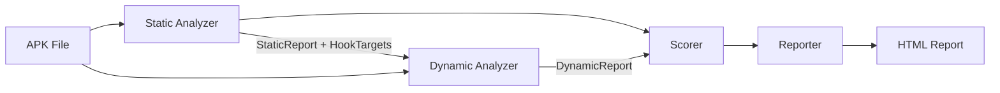
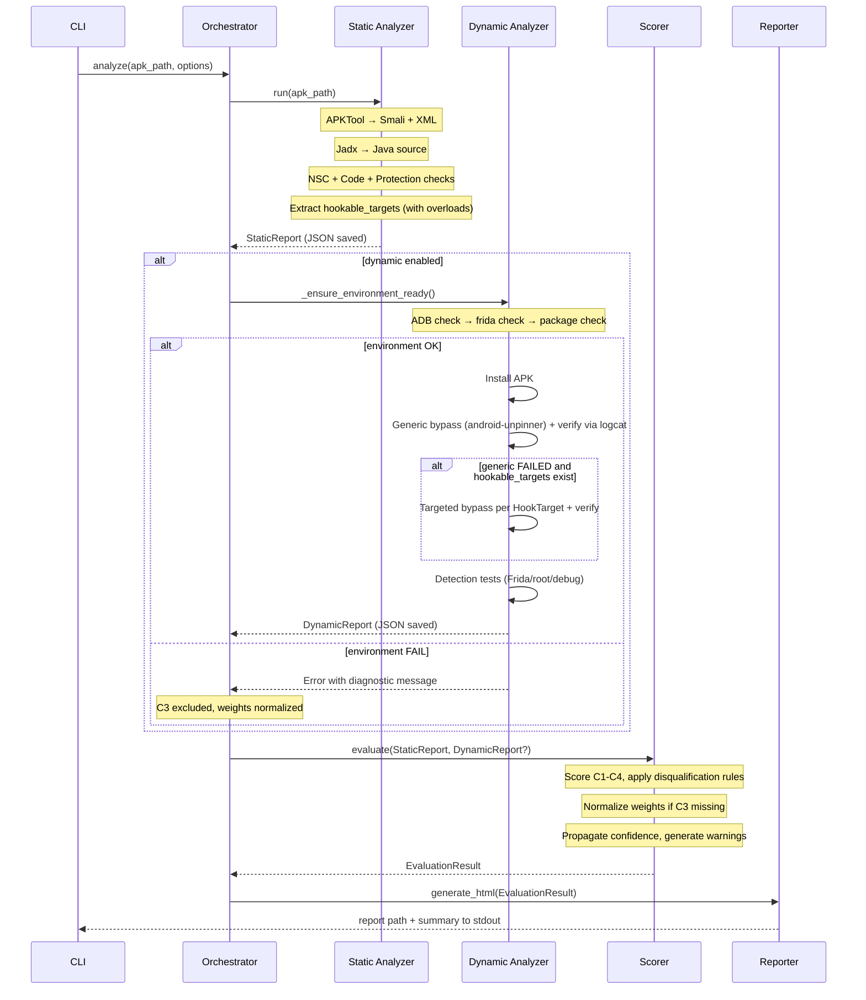

# TLS-PinEval V2 — Final Architecture (Implementation-Ready)

> All critical/important fixes from architecture review applied.
> Execution environment formally specified.

---

## 1. System Overview & Boundaries

**TLS-PinEval** — quantitative assessment algorithm for Android app security against TLS pinning bypass. 4 criteria (0–100 each), weighted final score, explainable breakdown.

| In Scope | Out of Scope |
|----------|-------------|
| TLS pinning implementation analysis | General vulnerability scanning |
| Frida-based bypass testing with verification | Full sandboxing / emulator management |
| Quantitative 4-criteria scoring | Advanced anti-analysis bypass R&D |
| Explainable per-finding reports | UI automation for app interaction |
| CLI-first interface | Web UI (future work) |
| Native Android (Java/Kotlin) apps | Flutter / React Native / Xamarin |
| Pre-configured device via ADB | Emulator provisioning & lifecycle |

### V1 vs Future

| Feature | V1 | Future |
|---------|:--:|:------:|
| Static analysis (all ToR §5 checks) | ✅ | |
| Hookable target extraction with overloads | ✅ | |
| Frida bypass with logcat verification | ✅ | |
| Anti-Frida/root detection testing | ✅ | |
| Quantitative scoring (C1–C4) with disqualification rules | ✅ | |
| C3 weight normalization when skipped | ✅ | |
| Confidence & inconclusive handling | ✅ | |
| HTML report | ✅ | |
| Environment pre-checks | ✅ | |
| PDF report | | ✅ |
| Full MITM interception | minimal | full |
| Web UI (Flask/Streamlit) | | ✅ |
| Cross-framework (Flutter/RN) | | ✅ |
| Multi-process hooking | | ✅ |

---

## 2. Execution Environment

### Responsibility Boundary

| Responsibility | Owner |
|---------------|-------|
| Provide Android device (emulator or physical) | **User** |
| Device visible via `adb devices` | **User** |
| `frida-server` installed, running, version-compatible | **User** |
| Network connectivity functional | **User** |
| Validate environment before dynamic analysis | **TLS-PinEval** |
| Fail fast with actionable error messages | **TLS-PinEval** |
| Install APK, spawn, hook, collect results | **TLS-PinEval** |

### Supported Environments (V1)

**Option A — Emulator (recommended):**
- Android Emulator (AVD) or Genymotion
- Android 11–14, x86/x86_64
- Root: required
- Google Play Services: optional

**Option B — Physical Device:**
- USB-connected, listed as `device` in `adb devices`
- Root: required for Frida server mode
- Non-root: only with Frida Gadget (not automated in V1)

### Mandatory Pre-Checks (`_ensure_environment_ready`)

Unified check in `dynamic/analyzer.py` — runs before any dynamic analysis:

```
Step 1: adb devices → at least one device in "device" state
        If FAIL → "No ADB device found. Connect device or start emulator."

Step 2: adb shell getprop ro.build.version.release → extract Android version
        If FAIL → "Cannot read device properties. Check USB debugging is enabled."

Step 3: frida.get_usb_device() → device object
        If FAIL → "Frida cannot connect to device. Is frida-server running?"

Step 4: frida.enumerate_processes() → process list
        If FAIL → "frida-server not responding. Check version compatibility."

Step 5: Verify package_name is valid (from AppInfo extracted during static phase)
        adb shell pm list packages | grep <package_name>
        If already installed → proceed
        If not installed → will install in next step

ANY failure → abort dynamic analysis, return clear diagnostic, NO partial DynamicReport
```

---

## 3. Architecture

Sequential pipeline. No separate infra layer.

```
┌───────────────────────────────────────┐
│              CLI (Click)              │
├───────────────────────────────────────┤
│            Orchestrator               │
├────────────┬───────────┬──────────────┤
│  Static    │  Dynamic  │   Scoring    │
│  Analyzer  │  Analyzer │  & Reporter  │
├────────────┴───────────┴──────────────┤
│          Domain Models (Pydantic v2)  │
└───────────────────────────────────────┘
```



---

## 4. Modules

### 4.1 `tools.py` — Utility

Thin subprocess wrappers: `run_apktool()`, `run_jadx()`, `run_adb()`. No lifecycle management — call tool, return output path.

### 4.2 Module 1 — Static Analyzer

**Input:** APK path → **Output:** `StaticReport` (JSON)

| File | Responsibility |
|------|---------------|
| `analyzer.py` | Orchestrate decompilation, run all checks, **extract hookable_targets** |
| `nsc_analyzer.py` | Parse `network_security_config.xml` |
| `code_analyzer.py` | Scan for CertificatePinner, TrustManager, HostnameVerifier, WebView SSL, hardcoded secrets |
| `protection_analyzer.py` | Obfuscation, native libs, SafetyNet/Play Integrity, root detection |
| `patterns.py` | Central regex/string pattern registry (Smali + Java) |

#### Hookable Target Extraction

```
HookTarget:
  class_name: str          # "com.app.net.PinManager"
  method_name: str         # "checkServerTrusted"
  category: HookCategory   # TRUST_MANAGER | CERTIFICATE_PINNER | HOSTNAME_VERIFIER | WEBVIEW_SSL | CUSTOM
  overloads: list[str]     # ["[Ljava.security.cert.X509Certificate;, java.lang.String"]
                           # empty = hook all overloads (fallback, confidence: MEDIUM)
  source_file: str
  confidence: Confidence
```

**Extraction rules:**

| Pattern Found | HookTarget | Confidence |
|--------------|-----------|------------|
| `TrustManager` impl, class name visible, descriptor parsed | class + method + overloads | HIGH |
| `CertificatePinner.Builder` with domain | class + `check` + overloads | HIGH |
| `HostnameVerifier` impl | class + `verify` + overloads | HIGH |
| `onReceivedSslError` override | class + method + overloads | HIGH |
| Obfuscated class referencing cert/pin strings | class + suspected method, overloads=[] | MEDIUM |
| Native `.so` with SSL symbols, no Java mapping | no specific target, flag only | LOW |

**If no targets found:** `hookable_targets = []` → dynamic runs generic-only → C1 = 0 (no pinning) with confidence HIGH.

### 4.3 Module 2 — Dynamic Analyzer

**Input:** APK + `StaticReport` → **Output:** `DynamicReport` (JSON)

**Precondition:** Device ready (validated by `_ensure_environment_ready`).

| File | Responsibility |
|------|---------------|
| `analyzer.py` | Orchestrate: pre-checks → install → spawn → run scripts → collect |
| `script_generator.py` | HookTarget → Frida JS; load generic scripts |
| `bypass_runner.py` | Execute bypass attempts with **verification**, record results |
| `detection_tester.py` | Anti-Frida/root/debug detection checks |

#### Execution Flow (Fixed Order: Generic → Targeted)

```
1. ENVIRONMENT PRE-CHECK
   └─ _ensure_environment_ready() — all 5 checks
   └─ If ANY fails → abort, return diagnostic error

2. INSTALL & PREPARE
   └─ adb install -r app.apk
   └─ Resolve package_name from AppInfo

3. GENERIC BYPASS (always, first)
   └─ frida.spawn(package, pause=True)
   └─ Inject android-unpinner universal script
   └─ device.resume(pid) — hooks active BEFORE app runs
   └─ Wait for app to make TLS connections
   └─ VERIFY bypass success (see Bypass Verification below)
   └─ Record result

4. TARGETED BYPASS (only if generic FAILED and hookable_targets exist)
   └─ For each HookTarget:
       └─ script_generator creates specific JS hook (using overloads if available)
       └─ frida.spawn() + inject BEFORE resume
       └─ VERIFY bypass success
       └─ Record: {target, hook_triggered, verification, duration_ms, logs[]}
   └─ Record: targeted_bypass_needed = true

5. DETECTION TESTS
   └─ Spawn app with Frida (no hooks) → does app detect Frida? → app_reaction
   └─ Check root detection behavior
   └─ Check debugger detection behavior

6. OPTIONAL: BASIC MITM CHECK (V1 minimal)
   └─ If bypass succeeded: check if traffic flows through proxy
   └─ If skipped → mitm_check.status = SKIPPED

7. PRODUCE DynamicReport
```

#### Bypass Verification (CRITICAL-1 Fix)

Hook firing ≠ bypass success. After each hook injection:

```
1. hook_triggered: bool — did the Frida callback fire?
2. VERIFY via logcat monitoring:
   - Scan for "SSLHandshakeException" / "SSLPeerUnverifiedException" → FAILED
   - Scan for HTTP 200 / response data indicators → SUCCESS
   - No network activity within timeout → INCONCLUSIVE
3. OPTIONAL: If proxy running, check if traffic arrived → SUCCESS
```

Result stored as `verification: SUCCESS | FAILED | INCONCLUSIVE` with `verification_method: "logcat" | "mitm" | "hook_only"`.

### 4.4 Module 3 — Scorer & Reporter

| File | Responsibility |
|------|---------------|
| `scorer.py` | Per-criterion scoring, disqualification rules, aggregation, weight normalization |
| `explainer.py` | Human-readable explanations, recommendations, warnings |
| `reporter.py` | HTML report via Jinja2 |

---

## 5. Domain Models

### 5.1 Enums

```
Confidence: HIGH | MEDIUM | LOW
Severity: CRITICAL | HIGH | MEDIUM | LOW | INFO
SecurityLevel: HIGH (85-100) | MEDIUM (60-84) | LOW (30-59) | CRITICAL (0-29)
HookCategory: TRUST_MANAGER | CERTIFICATE_PINNER | HOSTNAME_VERIFIER | WEBVIEW_SSL | CUSTOM
AppReaction: CRASH | BLOCK | IGNORE | NONE
VerificationResult: SUCCESS | FAILED | INCONCLUSIVE
MITMStatus: SUCCESS | FAILED | INCONCLUSIVE | SKIPPED
```

### 5.2 Core

```
AppInfo
├── apk_path: Path
├── package_name: str
├── app_name: str
├── version: str
├── min_sdk: int
├── target_sdk: int

Finding
├── id: str
├── category: str
├── description: str
├── location: str
├── severity: Severity
├── confidence: Confidence
├── raw_evidence: str
```

### 5.3 Static Report

```
StaticReport
├── app_info: AppInfo
├── findings: list[Finding]
├── nsc: NSCResult
│   ├── found: bool
│   ├── pin_sets: list[PinSet]       # domain, pins[], expiry, has_backup
│   └── cleartext_allowed: bool
├── pinning_implementations: list[PinningImpl]
│   ├── type: HookCategory
│   ├── class_name: str
│   ├── is_vulnerable: bool          # trust-all, allow-all, proceed-on-error
│   └── confidence: Confidence
├── protection: ProtectionProfile
│   ├── obfuscation_level: NONE | BASIC | STRONG
│   ├── native_libs: list[str]
│   ├── integrity_checks: list[str]
│   └── root_detection: bool
├── hookable_targets: list[HookTarget]
└── timestamp: datetime
```

### 5.4 Dynamic Report

```
DynamicReport
├── app_info: AppInfo
├── environment: Environment
│   ├── device_id: str
│   ├── android_version: str
│   ├── frida_version: str
│   └── is_rooted: bool
├── bypass_attempts: list[BypassAttempt]
│   ├── script_name: str
│   ├── target: HookTarget | None
│   ├── hook_triggered: bool
│   ├── verification: VerificationResult
│   ├── verification_method: str     # "logcat" | "mitm" | "hook_only"
│   ├── confidence: Confidence
│   ├── duration_ms: int
│   ├── error: str | None
│   ├── generated_script: str        # full Frida JS for thesis evidence
│   └── logs: list[str]
├── detection_results: DetectionResults
│   ├── frida_detected: bool
│   ├── root_detected: bool
│   ├── debugger_detected: bool
│   └── app_reaction: AppReaction
├── mitm_check: MITMCheck
│   ├── status: MITMStatus
│   └── note: str
├── overall_bypass: bool
├── targeted_bypass_needed: bool
└── timestamp: datetime
```

### 5.5 Evaluation

```
ScoreComponent
├── check_id: str
├── check_name: str
├── points: int
├── max_points: int
├── confidence: Confidence
├── rationale: str

CriterionScore
├── criterion_id: int              # 1–4
├── name: str
├── score: int                     # 0–100
├── weight: float
├── confidence: Confidence         # min(component confidences that awarded > 0)
├── components: list[ScoreComponent]
├── summary: str
├── warning: str | None            # set if >50% points from LOW confidence

EvaluationResult
├── app_info: AppInfo
├── criteria: list[CriterionScore] # exactly 4
├── final_score: float
├── security_level: SecurityLevel
├── recommendations: list[str]
├── warnings: list[str]
├── static_report_path: Path
├── dynamic_report_path: Path | None
└── timestamp: datetime
```

---

## 6. Scoring Logic

### Principle

Each criterion: set of checks → points with rationale → confidence scaling → aggregation. Every check maps to OWASP MASTG/MASVS or Android docs.

### Confidence Scaling

```
HIGH   → factor 1.0 (full points)
MEDIUM → factor 0.7 (30% penalty for uncertainty)
LOW    → factor 0.4 (60% penalty)

awarded_points = base_points × confidence_factor
```

Multipliers are **conservative penalty defaults**, configurable in `config.yaml`.

**Criterion confidence** = min confidence of any component that awarded > 0 points.
**Warning rule**: if >50% of a criterion's awarded points come from LOW-confidence components → warning flag.

### C1 — Implementation Correctness (weight: 0.30)

| Check | Max | OWASP Ref | Rationale |
|-------|-----|-----------|-----------|
| NSC pin-set with SHA-256 | 20 | MASTG-KNOW-0015 | Recommended pinning method |
| Backup pin configured | 15 | Android Security Config | Cert rotation resilience |
| Pin expiry set, reasonable (<1yr) | 10 | Android Security Config | Prevents stale pins |
| No cleartext traffic | 10 | MASTG-TEST-0244 | Cleartext bypasses TLS |
| No trust-all TrustManager | 20 | MASTG-TEST-0244 | Trust-all nullifies validation |
| No allow-all HostnameVerifier | 10 | MASTG-TEST-0244 | Allow-all enables MITM |
| WebView SSL errors handled | 15 | MASTG-KNOW-0015 | Proceed-on-error = no pinning |
| **Total** | **100** | | |

**Disqualification rule (CRITICAL-2 fix):** If ANY `PinningImpl` has `is_vulnerable: true` (trust-all, allow-all, proceed-on-error), C1 is **capped at 20 points max**. Rationale: a single insecure path breaks the entire TLS chain.

**No pinning at all:** C1 = 0, confidence HIGH.

### C2 — Static Bypass Resistance (weight: 0.25)

| Check | Max | Rationale |
|-------|-----|-----------|
| Code obfuscation (ProGuard/R8) | 30 | Increases RE effort |
| Pinning logic in native .so | 25 | Native significantly harder to patch |
| APK integrity (SafetyNet/Play Integrity) | 20 | Detects repackaged APKs |
| No hardcoded pins in plaintext | 15 | Plaintext trivially found |
| Root/environment detection | 10 | Detects compromised env |
| **Total** | **100** | |

### C3 — Dynamic Bypass Resistance (weight: 0.30)

| Check | Max | Rationale |
|-------|-----|-----------|
| Generic bypass (android-unpinner) failed | 35 | Generic success = trivially vulnerable |
| Targeted bypass also failed | 25 | Resistant to researcher-level hooks |
| App detects Frida (crash/block) | 20 | Active anti-instrumentation |
| App detects root | 10 | Refuses unsafe environment |
| App detects debugger | 10 | Anti-debugging defense |
| **Total** | **100** | |

**Rules:**
- Dynamic not run → C3 excluded from aggregation (weight normalization)
- Generic succeeded → skip targeted, `targeted_bypass_needed = false`
- App crashes on Frida attach before hooks → `frida_detected = true` (+20), bypass = INCONCLUSIVE
- Frida hook timeout → `verification: INCONCLUSIVE`, confidence MEDIUM

**Innovation signal:** generic failed + targeted succeeded → moderate protection. Both failed → strong.

### C4 — Comprehensive Protection (weight: 0.15)

| Check | Max | Rationale | Measurable from |
|-------|-----|-----------|----------------|
| Multiple pinning methods (NSC + programmatic) | 30 | Defense-in-depth | Static: count implementations |
| Custom (non-standard) pinning logic | 25 | Harder to bypass with known scripts | Static: CUSTOM HookTarget |
| Native + Java pinning combined | 25 | Multi-layer defense | Static: native_libs + PinningImpl |
| Anti-tampering (SafetyNet/Play Integrity) | 20 | Detects repackaged APKs | Static: integrity_checks |
| **Total** | **100** | | |

### Aggregation

```
Normal case (dynamic ran):
  final = C1×0.30 + C2×0.25 + C3×0.30 + C4×0.15

Dynamic skipped (C3 not evaluated):
  final = (C1×0.30 + C2×0.25 + C4×0.15) / (0.30 + 0.25 + 0.15)
  Report: "Score based on static analysis only. May change with dynamic testing."
```

### SecurityLevel

```
85–100 → HIGH
60–84  → MEDIUM
30–59  → LOW
 0–29  → CRITICAL
```

---

## 7. Data Flow



---

## 8. CLI Design

```
tls-pineval [OPTIONS] COMMAND

Commands:
  analyze    Full pipeline: static + dynamic + scoring + report
  static     Static analysis only (no device needed)
  dynamic    Dynamic analysis (requires --static-report)
  score      Score from existing reports

Options:
  -o, --output-dir PATH    Output directory [default: ./results]
  -v, --verbose            Enable debug logging
  -c, --config PATH        Config YAML override
```

```bash
# Most common: full analysis
tls-pineval analyze app.apk -o ./results

# Static only (no device)
tls-pineval static app.apk -o ./results

# Dynamic with prior static
tls-pineval dynamic app.apk --static-report ./results/static_report.json

# Re-score
tls-pineval score --static ./results/static_report.json \
                  --dynamic ./results/dynamic_report.json
```

---

## 9. Risks & Mitigations

| Risk | V1 Mitigation |
|------|---------------|
| Heavy obfuscation hides patterns | `confidence: LOW`, warning in report |
| App crashes on Frida attach | Record as "Frida detected" (+20 C3), bypass = INCONCLUSIVE |
| No network traffic | `mitm_check: INCONCLUSIVE`, score from hook verification only |
| Trust-all + correct NSC coexist | C1 capped at 20 (disqualification rule) |
| Hook fires but bypass didn't work | Logcat verification catches this |
| Generic bypass succeeded | Skip targeted, `targeted_bypass_needed = false` |
| Scoring appears arbitrary | OWASP references, configurable weights, rationale per check |
| Dynamic skipped → distorted score | Weight normalization, explicit report note |
| >50% LOW confidence in criterion | Warning flag in report |
| Frida/ADB not available | `_ensure_environment_ready()` fails fast with diagnostic |

---

## 10. Project Structure

```
d:\VKR_new\
├── tls_pineval/
│   ├── __init__.py
│   ├── __main__.py              # python -m tls_pineval
│   ├── cli.py                   # Click CLI
│   ├── orchestrator.py          # Pipeline coordination
│   ├── config.py                # YAML config loader
│   ├── tools.py                 # Thin wrappers: apktool, jadx, adb
│   │
│   ├── models/
│   │   ├── __init__.py
│   │   ├── common.py            # AppInfo, Finding, Confidence, Severity, enums
│   │   ├── static_report.py     # StaticReport, HookTarget, NSCResult, PinningImpl
│   │   ├── dynamic_report.py    # DynamicReport, BypassAttempt, DetectionResults
│   │   └── evaluation.py        # CriterionScore, EvaluationResult, SecurityLevel
│   │
│   ├── static/
│   │   ├── __init__.py
│   │   ├── analyzer.py          # Orchestrator + hookable target extraction
│   │   ├── nsc_analyzer.py      # network_security_config.xml
│   │   ├── code_analyzer.py     # CertPinner, TrustManager, HostnameVerifier, WebView, secrets
│   │   ├── protection_analyzer.py
│   │   └── patterns.py          # Regex/string pattern registry
│   │
│   ├── dynamic/
│   │   ├── __init__.py
│   │   ├── analyzer.py          # Orchestrator + _ensure_environment_ready()
│   │   ├── script_generator.py  # HookTarget → Frida JS (with overloads)
│   │   ├── bypass_runner.py     # Execute + verify (logcat) + record
│   │   ├── detection_tester.py  # Anti-Frida/root/debug
│   │   └── scripts/
│   │       ├── generic_unpinner.js
│   │       ├── trustmanager_hook.js
│   │       ├── okhttp_hook.js
│   │       ├── webview_hook.js
│   │       └── detection_check.js
│   │
│   ├── scoring/
│   │   ├── __init__.py
│   │   ├── scorer.py            # C1-C4 + disqualification + normalization
│   │   ├── explainer.py         # Explanations + recommendations
│   │   └── reporter.py          # HTML via Jinja2
│   │
│   └── templates/
│       ├── report.html
│       └── styles.css
│
├── config/
│   └── default.yaml
│
├── tests/
│   ├── test_static.py
│   ├── test_scoring.py
│   └── fixtures/
│
├── docs/
│   └── environment_setup.md     # ADB, frida-server, emulator setup guide
│
├── knowledge/
├── pyproject.toml
├── requirements.txt
└── README.md
```

---

## 11. Implementation Order

| Phase | Days | What | Dependencies |
|-------|------|------|-------------|
| 1. Models | 1 | All Pydantic schemas | None |
| 2. Static Analyzer | 2–5 | Decompilation + all checks + hookable targets | Models |
| 3. Scorer | 6–7 | C1-C4 scoring, disqualification, normalization | Models, static patterns |
| 4. Dynamic Analyzer | 8–11 | Frida integration, bypass verification, detection | Models, device |
| 5. Reporter | 12 | Jinja2 HTML template | Scorer output |
| 6. CLI + Orchestrator | 13 | Click commands, pipeline glue | All modules |
| 7. Testing + docs | 14–15 | E2E on real APKs, environment_setup.md | Everything |
