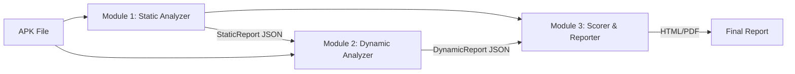
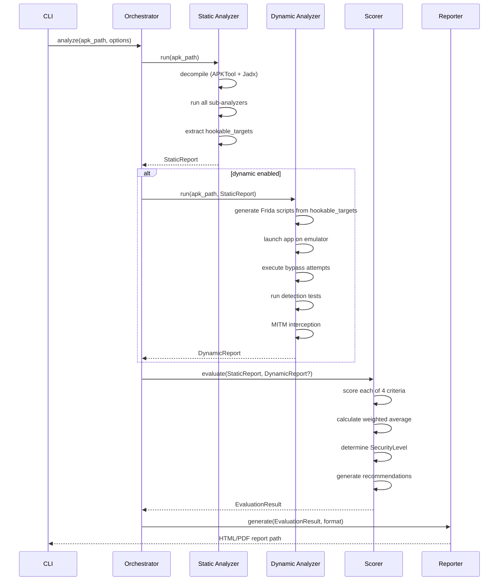

# TLS-PinEval — Architecture Design

## 1. System Overview

**TLS-PinEval** is an automated algorithm for comprehensive quantitative assessment of Android application security against TLS pinning bypass attacks. It evaluates apps across **4 criteria** (per Chapter 1):

| # | Criterion | Weight | What it measures |
|---|-----------|--------|-----------------|
| C1 | Implementation Correctness | 30% | Proper TLS pinning configuration |
| C2 | Static Bypass Resistance | 25% | Resistance to reverse-engineering & patching |
| C3 | Dynamic Bypass Resistance | 30% | Resistance to runtime instrumentation (Frida) |
| C4 | Comprehensive Protection | 15% | Anti-analysis, root detection, native code |

**Key differentiator vs MobSF:** TLS-PinEval provides a *quantitative, per-criterion score* (0–100) with explanations, not binary pass/fail results.

**Tech stack** (per ToR §9): Python 3.11+, Jadx, APKTool, Frida, mitmproxy, BeautifulSoup, Pandas. CLI primary, optional Flask/Streamlit web UI.

---

## 2. Architecture

The system follows a **sequential pipeline** architecture (per ToR §4): static analysis results feed into the dynamic module for test optimization.



### Layered Architecture

```
┌─────────────────────────────────────────────┐
│                  CLI Layer                   │  ← Click-based CLI
├─────────────────────────────────────────────┤
│               Orchestrator                   │  ← Pipeline coordination
├──────────┬──────────┬───────────────────────┤
│ Static   │ Dynamic  │ Scorer & Reporter     │  ← Core modules
│ Analyzer │ Analyzer │                       │
├──────────┴──────────┴───────────────────────┤
│              Domain Models                   │  ← Pydantic schemas
├─────────────────────────────────────────────┤
│           Infrastructure Layer               │  ← APKTool, Jadx, Frida, mitmproxy wrappers
└─────────────────────────────────────────────┘
```

---

## 3. Modules

### 3.1 Infrastructure Layer (`tls_pineval/infra/`)

Low-level wrappers around external tools. Each wrapper is isolated and testable.

| Wrapper | Responsibility |
|---------|---------------|
| `apktool.py` | Decompile APK → Smali + resources |
| `jadx.py` | Decompile APK → Java/Kotlin source |
| `frida_client.py` | Attach to process, load scripts, collect hooks output |
| `mitmproxy_client.py` | Start/stop proxy, capture TLS handshake results |
| `emulator.py` | Manage emulator lifecycle (start, install APK, forward ports) |
| `adb.py` | ADB commands: install, launch, logcat, push/pull |

### 3.2 Module 1 — Static Analyzer (`tls_pineval/static/`)

**Input:** APK file path  
**Output:** `StaticReport` (JSON)

| Sub-module | What it checks (per ToR §5) |
|------------|----------------------------|
| `nsc_analyzer.py` | `network_security_config.xml`: pin-set, SHA-256, backup-pin, pin-expiry, cleartextTrafficPermitted |
| `okhttp_analyzer.py` | `CertificatePinner` usage patterns in decompiled source |
| `trustmanager_analyzer.py` | Custom `TrustManager`, `checkServerTrusted` — detect trust-all patterns |
| `hostname_analyzer.py` | `HostnameVerifier` implementations — detect allow-all |
| `webview_analyzer.py` | `onReceivedSslError` in `WebViewClient` — detect proceed-on-error |
| `protection_analyzer.py` | Obfuscation (ProGuard/R8 markers), native `.so` libs, SafetyNet/Play Integrity calls |
| `secrets_scanner.py` | Hardcoded pins, certificates, keys in string constants |
| `pattern_registry.py` | Central registry of search patterns (Smali, Java, Kotlin, XML) |

**Flow:** APK → APKTool (Smali + XML) + Jadx (Java) → run all sub-analyzers → merge into `StaticReport`.

### 3.3 Module 2 — Dynamic Analyzer (`tls_pineval/dynamic/`)

**Input:** APK + `StaticReport`  
**Output:** `DynamicReport` (JSON)

| Sub-module | Responsibility (per ToR §6) |
|------------|----------------------------|
| `script_generator.py` | Generate targeted Frida scripts based on static findings (hook only found classes/methods) |
| `bypass_runner.py` | Execute bypass attempts: standard scripts (android-unpinner) + custom hooks |
| `detection_tester.py` | Test app reaction to: Frida detection, debugging, root environment |
| `mitm_tester.py` | MITM interception after successful/failed bypass via mitmproxy |
| `session_recorder.py` | Record bypass attempts: time, count, success/failure per method |

**Flow:** StaticReport → generate targeted scripts → launch app on emulator → run bypass sequence → capture MITM results → produce `DynamicReport`.

### 3.4 Module 3 — Scorer & Reporter (`tls_pineval/scoring/`)

**Input:** `StaticReport` + `DynamicReport`  
**Output:** `EvaluationResult` → HTML/PDF report

| Sub-module | Responsibility (per ToR §7-8) |
|------------|-------------------------------|
| `criteria.py` | Scoring logic for each of 4 criteria (0–100 scale) |
| `weights.py` | Configurable weights (default: 30/25/30/15) |
| `aggregator.py` | Weighted average → final score + security level |
| `explainer.py` | Generate human-readable explanations per finding |
| `recommendations.py` | Generate improvement recommendations |
| `report_html.py` | HTML report with tables & charts (Jinja2) |
| `report_pdf.py` | PDF generation from HTML (weasyprint/pdfkit) |

### 3.5 Orchestrator (`tls_pineval/orchestrator.py`)

Coordinates the full pipeline: validates inputs → runs static → runs dynamic → scores → generates report. Handles partial runs (static-only, skip-dynamic).

### 3.6 CLI Layer (`tls_pineval/cli.py`)

Click-based CLI entry point. See §6 below for full design.

---

## 4. Domain Models

All models use **Pydantic v2** for validation and JSON serialization.

### 4.1 Core Input/Output

```
AppInfo
├── apk_path: Path
├── package_name: str
├── app_name: str
├── version: str
├── min_sdk: int
├── target_sdk: int
└── permissions: list[str]
```

### 4.2 Static Analysis Models

```
StaticReport
├── app_info: AppInfo
├── nsc_findings: NSCFindings
│   ├── has_nsc: bool
│   ├── pin_sets: list[PinSetEntry]  # domain, pins[], expiry, has_backup
│   ├── cleartext_allowed: bool
│   └── issues: list[Finding]
├── okhttp_findings: list[OkHttpPinning]
│   └── class_name, method, pins[], has_backup, hostname_verified
├── trustmanager_findings: list[TrustManagerFinding]
│   └── class_name, is_trust_all, has_custom_logic, location
├── hostname_verifier_findings: list[HostnameVerifierFinding]
│   └── class_name, is_allow_all, location
├── webview_findings: list[WebViewFinding]
│   └── class_name, ignores_ssl_errors, location
├── protection_findings: ProtectionFindings
│   ├── obfuscation_detected: bool
│   ├── obfuscation_level: str  # none | basic | strong
│   ├── native_libs: list[str]  # .so file paths
│   ├── integrity_checks: list[str]  # SafetyNet, Play Integrity
│   └── root_detection: bool
├── hardcoded_secrets: list[SecretFinding]
├── hookable_targets: list[HookTarget]
│   └── class_name, method_name, signature, source (for dynamic module)
└── timestamp: datetime
```

### 4.3 Dynamic Analysis Models

```
DynamicReport
├── app_info: AppInfo
├── environment: DynEnvironment
│   └── android_version, emulator_type, frida_version, is_rooted
├── bypass_attempts: list[BypassAttempt]
│   ├── script_name: str
│   ├── target: HookTarget
│   ├── success: bool
│   ├── duration_ms: int
│   └── logs: list[str]
├── detection_results: DetectionResults
│   ├── frida_detected: bool
│   ├── root_detected: bool
│   ├── debugger_detected: bool
│   └── app_reaction: str  # crash | block | ignore | none
├── mitm_results: MITMResults
│   ├── traffic_intercepted: bool
│   ├── pinning_enforced: bool
│   └── captured_domains: list[str]
├── overall_bypass_success: bool
├── total_attempts: int
├── successful_attempts: int
└── timestamp: datetime
```

### 4.4 Scoring Models

```
CriterionScore
├── criterion_id: int  # 1-4
├── criterion_name: str
├── score: int  # 0-100
├── max_score: int  # 100
├── weight: float
├── breakdown: list[ScoreComponent]
│   └── check_name, points_awarded, max_points, explanation
└── findings: list[str]  # human-readable explanations

EvaluationResult
├── app_info: AppInfo
├── criteria_scores: list[CriterionScore]  # exactly 4
├── final_score: float  # weighted average 0-100
├── security_level: SecurityLevel  # HIGH | MEDIUM | LOW | CRITICAL
├── recommendations: list[Recommendation]
│   └── priority, criterion_id, title, description
├── static_report: StaticReport
├── dynamic_report: DynamicReport | None
└── timestamp: datetime

SecurityLevel (Enum, per ToR §7):
  HIGH     = 85-100
  MEDIUM   = 60-84
  LOW      = 30-59
  CRITICAL = 0-29
```

---

## 5. Data Flow



> [!IMPORTANT]
> The static → dynamic handoff is critical: `hookable_targets` from `StaticReport` drive targeted Frida script generation in the dynamic module. This is a key design requirement from ToR §6.

---

## 6. CLI Design

Built with **Click** framework. Single entry point `tls-pineval`.

```
tls-pineval [OPTIONS] COMMAND [ARGS]

Commands:
  analyze    Run full analysis pipeline (static + dynamic + scoring)
  static     Run static analysis only
  dynamic    Run dynamic analysis (requires prior static report)
  score      Score from existing static/dynamic reports
  report     Generate report from existing evaluation result

Global Options:
  --verbose / -v       Verbose logging
  --output-dir / -o    Output directory (default: ./results)
  --config / -c        Path to config YAML (weights, patterns, thresholds)
  --format             Report format: html | pdf | both (default: both)
```

### Key Commands

```bash
# Full pipeline
tls-pineval analyze app.apk -o ./results --format both

# Static only (no emulator needed)
tls-pineval static app.apk -o ./results

# Dynamic with existing static report
tls-pineval dynamic app.apk --static-report ./results/static_report.json \
    --device emulator-5554

# Re-score with custom weights
tls-pineval score --static-report ./results/static_report.json \
    --dynamic-report ./results/dynamic_report.json \
    --weights 30,25,30,15

# Regenerate report
tls-pineval report ./results/evaluation.json --format pdf
```

### Configuration File (`config.yaml`)

```yaml
weights:
  implementation_correctness: 0.30
  static_resilience: 0.25
  dynamic_resilience: 0.30
  comprehensive_protection: 0.15

scoring:
  c1_backup_pin: 25
  c1_pin_expiry: 20
  c1_sha256: 20
  c1_hostname_verify: 15
  c1_no_trust_all: 20
  c2_strong_obfuscation: 40
  c2_native_code: 30
  c2_integrity_check: 20
  c2_no_hardcoded: 10
  c3_bypass_failed: 50
  c3_frida_detected: 30
  c3_env_blocking: 20

dynamic:
  android_versions: [11, 12, 13, 14, 15]
  emulator: genymotion  # or avd
  frida_timeout_sec: 60
  max_bypass_attempts: 5

tools:
  jadx_path: jadx
  apktool_path: apktool
  frida_path: frida
```

---

## 7. Risks & Edge Cases

| # | Risk | Impact | Mitigation |
|---|------|--------|------------|
| 1 | **APK with split APKs / App Bundles** | Decompilation may fail or miss code | Detect split APKs, merge before analysis, warn user |
| 2 | **Heavy obfuscation** (DexGuard, iXGuard) | Static patterns not matched | Use fuzzy matching, behavioral heuristics, flag as "inconclusive" |
| 3 | **Native-only pinning** (.so) | Smali/Java analysis misses it | Scan for SSL/TLS symbols in .so files, flag for manual review |
| 4 | **Emulator detection by app** | App refuses to run → dynamic fails | Support physical device fallback, use anti-detection emulator configs |
| 5 | **Frida detection** | App crashes before hooks activate | Use frida-gadget injection, delayed instrumentation, multiple spawn modes |
| 6 | **No network traffic during test** | MITM test inconclusive | Implement UI automation (basic taps), extend timeout, flag as inconclusive |
| 7 | **Multi-process apps** | Frida hooks miss child processes | Hook all processes, monitor `fork()` calls |
| 8 | **Flutter/React Native/Xamarin** | Non-standard TLS stack | Add framework-specific pattern sets and bypass scripts |
| 9 | **Large APK (>500MB)** | Decompilation timeout/OOM | Set resource limits, stream-process Smali files, parallelize |
| 10 | **Dynamic code loading** (DexClassLoader) | Pinning code loaded at runtime | Detect classloader usage statically, flag for dynamic verification |
| 11 | **Scoring subjectivity** | Weights/points may not fit all scenarios | Make all scoring parameters configurable via YAML |
| 12 | **Tool version drift** | Frida/APKTool API changes | Pin versions in requirements, add version checks at startup |

---

## 8. Final Project Structure

```
d:\VKR_new\
├── tls_pineval/
│   ├── __init__.py
│   ├── __main__.py                  # python -m tls_pineval
│   ├── cli.py                       # Click CLI entry point
│   ├── orchestrator.py              # Pipeline coordination
│   ├── config.py                    # Config loader (YAML → Pydantic)
│   │
│   ├── models/                      # Domain models (Pydantic v2)
│   │   ├── __init__.py
│   │   ├── app_info.py              # AppInfo
│   │   ├── static_report.py         # StaticReport + sub-models
│   │   ├── dynamic_report.py        # DynamicReport + sub-models
│   │   ├── evaluation.py            # CriterionScore, EvaluationResult
│   │   └── enums.py                 # SecurityLevel, ObfuscationLevel
│   │
│   ├── static/                      # Module 1: Static Analyzer
│   │   ├── __init__.py
│   │   ├── analyzer.py              # Static analysis orchestrator
│   │   ├── nsc_analyzer.py          # network_security_config.xml
│   │   ├── okhttp_analyzer.py       # CertificatePinner patterns
│   │   ├── trustmanager_analyzer.py # TrustManager / checkServerTrusted
│   │   ├── hostname_analyzer.py     # HostnameVerifier
│   │   ├── webview_analyzer.py      # WebViewClient SSL errors
│   │   ├── protection_analyzer.py   # Obfuscation, native libs, integrity
│   │   ├── secrets_scanner.py       # Hardcoded pins/certs/keys
│   │   └── pattern_registry.py      # Centralized search patterns
│   │
│   ├── dynamic/                     # Module 2: Dynamic Analyzer
│   │   ├── __init__.py
│   │   ├── analyzer.py              # Dynamic analysis orchestrator
│   │   ├── script_generator.py      # Frida script generation from StaticReport
│   │   ├── bypass_runner.py         # Bypass attempt execution
│   │   ├── detection_tester.py      # Frida/root/debug detection tests
│   │   ├── mitm_tester.py           # MITM interception via mitmproxy
│   │   ├── session_recorder.py      # Attempt timing & logging
│   │   └── scripts/                 # Frida script templates
│   │       ├── android_unpinner.js
│   │       ├── trustmanager_hook.js
│   │       ├── okhttp_hook.js
│   │       ├── webview_hook.js
│   │       └── detection_check.js
│   │
│   ├── scoring/                     # Module 3: Scorer & Reporter
│   │   ├── __init__.py
│   │   ├── criteria.py              # Per-criterion scoring logic
│   │   ├── weights.py               # Weight configuration
│   │   ├── aggregator.py            # Weighted average calculation
│   │   ├── explainer.py             # Human-readable explanations
│   │   ├── recommendations.py       # Improvement suggestions
│   │   ├── report_html.py           # HTML report generation
│   │   └── report_pdf.py            # PDF report generation
│   │
│   ├── infra/                       # External tool wrappers
│   │   ├── __init__.py
│   │   ├── apktool.py               # APKTool wrapper
│   │   ├── jadx.py                  # Jadx wrapper
│   │   ├── frida_client.py          # Frida wrapper
│   │   ├── mitmproxy_client.py      # mitmproxy wrapper
│   │   ├── emulator.py              # Emulator lifecycle
│   │   └── adb.py                   # ADB commands
│   │
│   └── templates/                   # Jinja2 report templates
│       ├── report.html
│       └── styles.css
│
├── config/
│   └── default.yaml                 # Default scoring config
│
├── tests/
│   ├── __init__.py
│   ├── test_static/
│   ├── test_dynamic/
│   ├── test_scoring/
│   ├── test_infra/
│   ├── fixtures/                    # Sample APKs, mock reports
│   └── conftest.py
│
├── knowledge/                       # Existing docs (read-only)
│   ├── Terms_of_Reference.md
│   ├── Security_criteria.md
│   └── Analysis_of_existing_tools.md
│
├── pyproject.toml                   # Project metadata, dependencies
├── requirements.txt                 # Pinned dependencies
├── README.md
└── .gitignore
```

---

## Open Questions

> [!IMPORTANT]
> **Q1: Physical device support scope.** The ToR mentions "emulator or physical device (if possible)." Should we build first-class physical device support, or treat it as a stretch goal with emulator as primary?

> [!IMPORTANT]
> **Q2: Web UI priority.** ToR §9 mentions Flask/Streamlit web interface. Should we design for it from the start (e.g., expose a service layer), or build CLI-first and add web later?

> [!IMPORTANT]
> **Q3: Cross-framework support.** Should the initial version handle Flutter/React Native/Xamarin apps, or focus on native Android (Java/Kotlin) only?

> [!IMPORTANT]  
> **Q4: MobSF comparison in report.** ToR §8 item 6 mentions "Comparison with MobSF." Should we run MobSF in parallel and include its results, or just reference our architectural advantages?

## Verification Plan

### Automated Tests
- Unit tests per sub-analyzer with fixture APKs
- Integration test: full pipeline on known-vulnerable and known-secure test APKs
- Scoring consistency tests: same input → same output

### Manual Verification
- Test against 3–5 real-world APKs (various pinning implementations)
- Compare results with manual Frida bypass to validate dynamic module accuracy
- Review HTML/PDF report readability with a security specialist
